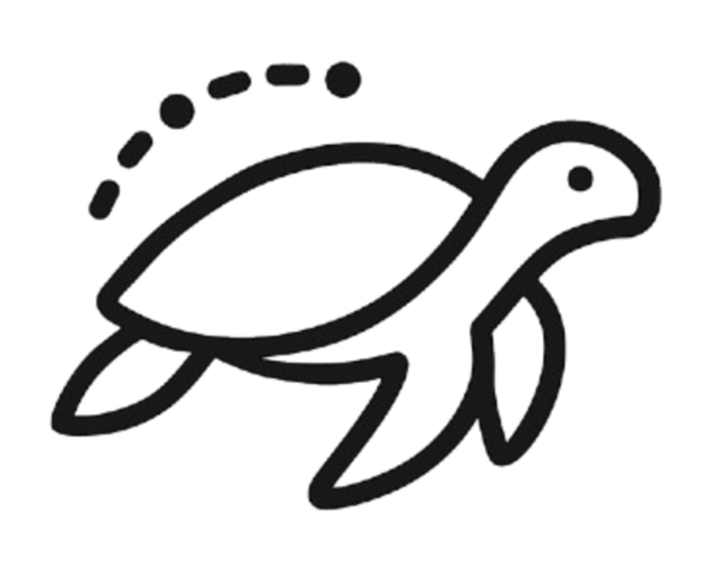

<div align="center">



# Si Penyu

**Sistem informasi pendataan, pengawasan, dan pelaporan konservasi penyu di Indonesia**


</div>

---

## Tentang

Si Penyu membantu kelompok konservasi mencatat perjalanan penyu **dari induk yang naik ke pantai sampai
tukik dilepas ke laut**, secara digital. Data yang terkumpul direkap otomatis per bulan dan per tahun,
lalu dicetak menjadi laporan PDF untuk pengelola dan sponsor.

Sistem ini pertama kali diuji coba di **Pokmaswas Pantai Taman Kili Kili, Panggul, Trenggalek**, dengan
dukungan **Pertamina Patra Niaga** dan **Universitas Brawijaya**.

## Alur pendataan

```text
 🐢 Penyu Naik ──► 🥚 Telur Dikerami ──► 🐣 Telur Menetas ──► 🏠 Inkubasi ──► 🌊 Tukik Dilepas
  (bertelur /                              (jenis penyu)        (inkubator)  └─► ✝ Tukik Mati
   tidak bertelur, zona)
```

Setiap tahap mencatat tanggal, jumlah, keterangan, dan petugas penanggung jawab, sehingga setiap tukik
yang dilepas bisa ditelusuri asal-usulnya.

## Fitur

| Fitur | Status |
| --- | --- |
| Landing page, profil, dan halaman *Tentang Kami* | ✅ Aktif |
| Daftar laporan dan penampil PDF | ✅ Aktif (data contoh) |
| Pendataan penyu naik, pengeraman, penetasan, inkubasi, pelepasan, dan kematian | 🚧 Dibangun ulang |
| Manajemen pengguna, inkubator, dan zona pantai | 🚧 Dibangun ulang |
| Dashboard admin (tabel untuk desktop, kartu untuk mobile) | 🚧 Dibangun ulang |
| Laporan otomatis bulanan dan tahunan (PDF + grafik) | 🚧 Dibangun ulang |
| Login petugas | 🚧 Dibangun ulang |

> Proyek ini awalnya dibuat tahun 2022 dan sedang dimigrasikan dari Prisma + CockroachDB ke
> Appwrite / Firebase. Selama migrasi, halaman `/pendataan` dan `/login` menampilkan *Under Construction*.

## Teknologi

- **Framework:** Next.js (App Router), React 18, TypeScript
- **UI:** Tailwind CSS, shadcn/ui (Radix UI), lucide-react
- **Data:** TanStack Query, TanStack Table, React Hook Form + Zod
- **Database:** Prisma + CockroachDB, sedang pindah ke Appwrite / Firebase
- **Laporan:** `@react-pdf/renderer`, Chart.js, `react-pdf`
- **Tooling:** pnpm, Storybook, Million.js, Vercel Analytics

## Memulai

### Prasyarat

- Node.js 20+ dan [pnpm](https://pnpm.io/)
- Docker (opsional, untuk database lokal)

### Instalasi

```bash
git clone git@github.com:mderryr/pendataan-tukik-migration.git
cd pendataan-tukik-migration
pnpm install
```

## Terima kasih

- **Pertamina Patra Niaga** — inisiator dan sponsor awal
- **Universitas Brawijaya** — mitra pengembangan
- **Pokmaswas Pantai Taman Kili Kili** — lokasi uji coba sistem
- **Pemerintah Kabupaten Trenggalek**

---

<div align="center">
Dibuat untuk laut Indonesia yang lebih lestari 🌊🐢
</div>
